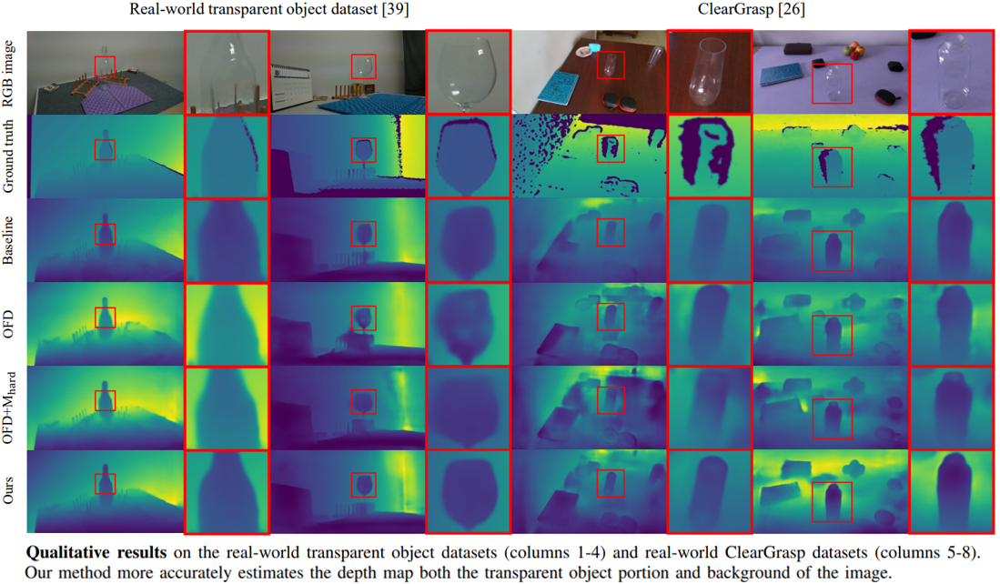
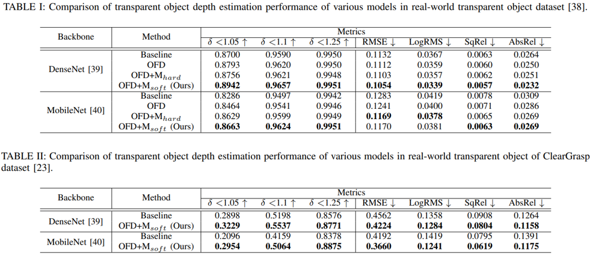

## TransDepth

### 0. 개요
  
  

    3차원 정보를 생성하기 위한 일반적인 3D 센서들은 기본적으로 영상 이미지 내의 모든 객체의 표면이 램버시안 반사(Lambertian reflection)에 의해 구동되기 때문에 모든 시야각에서 객체의 균일한 표면 밝기를 얻을 수 있는 반면, 투명 객체의 빛을 반사 및 굴절시키는 특성들은 이러한 가정을 무시하게 된다. 따라서 일반적으로 사용되는 3D 센서를 통해 투명 객체의 3차원 정보를 생성할 경우 대부분 유효하지 않거나 예측할 수 없는 노이즈(noise)를 포함하게 된다. 게다가 투명 객체는 투명도 및 시각적 특성에 의해 배경의 색과 섞이게 된다. 이로 인해 동일한 투명 객체도 시야각이나 조명 및 폐색(occlusion)과 같은 환경에 따라 전혀 다른 객체로 인식될 수 있다. 따라서 일반적인 객체들(불투명 객체)을 위해 설계된 다양한 컴퓨터 비전 응용 기술들을 직접 투명 객체를 위해 적용하는 데는 한계가 분명하게 존재한다. 특히, 배경의 간섭 문제는 영상의 특징(feature) 혹은 특징점(feature point)을 기반으로 수행되는 3차원 정보 추정을 상당히 어렵게 만든다. 
    
    본 연구는 투명도, 빛의 굴절 흐름(refractive flow) 및 반사(reflect) 혹은 감쇠(attenuation) 등의 투명 객체 특성에 대해 분석하고 이를 기반으로 지식 증류(Knowledge Distillation) 기법을 응용하여 배경의 간섭으로부터 강인한 투명 객체 3차원 정보 추정 방법을 제안한다.
  
### 1. 데이터셋 파일 경로

  코드 경로: ./  
  데이터 경로: ./datasets  
  학습된 모델의 경로: ./weights  
  샘플 경로: ./samples  

****

### 2. 설치

      conda create --name transdepth python=3.10 -y; conda activate transdepth
      conda install pip; pip install --upgrade pip
      pip install keras
      pip install pillow
      pip install matplotlib
      pip install scikit-learn
      pip install scikit-image
      pip install opencv-python
      pip install pydot
      
****

### 3. 학습

      python train_FKD.py --data nyu --gpus 4 --bs 8

****

### 4. 참고

* DenseDepth: [https://github.com/NVlabs/instant-ngp.git](https://github.com/ialhashim/DenseDepth.git)
      
      
 
